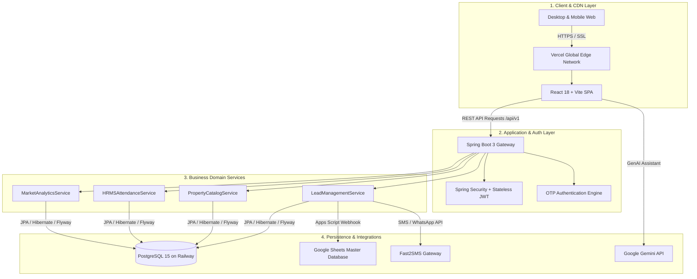

<div align="center">

# 🏛️ 24K REALTORS — LUXURY REAL ESTATE & CRM PLATFORM
### *Pune West's #1 MahaRERA Verified Real Estate Advisory & Enterprise CRM*

[](https://github.com/24krealtorshinjewadi-blip/24K-Realtors-Website/actions/workflows/ci.yml)
[](https://maharera.mahaonline.gov.in/)
[](https://openjdk.org/projects/jdk/21/)
[](https://spring.io/projects/spring-boot)
[](https://react.dev/)
[](https://vitejs.dev/)
[](https://www.postgresql.org/)
[](https://real-estate-digital-marketing.vercel.app)
[](./LICENSE)

**[🌐 Live Portal](https://real-estate-digital-marketing.vercel.app)** • **[📊 Master Google Sheet](https://docs.google.com/spreadsheets/d/1Reu4yjYVHLY0DRgDN52dz9OP55wgGEWGDdPH_zvuQLM/edit?usp=sharing)** • **[📋 Handover Guide](./HANDOVER.md)** • **[📖 Google Sheets Guide](./docs/GOOGLE_SHEETS_INTEGRATION_GUIDE.md)** • **[🐛 Report Issue](https://github.com/24krealtorshinjewadi-blip/24K-Realtors-Website/issues/new?template=bug_report.yml)**

</div>

---

## 📌 Overview

**24K Realtors** is an enterprise-grade, full-stack digital real estate ecosystem tailored for Pune's high-velocity luxury corridors (**Hinjewadi, Baner, Wakad, Mahalunge, Balewadi, and Kharadi**). 

The platform bridges high-intent property buyers, investors, and HNIs with a state-of-the-art consumer experience while equipping the sales advisory team with an autonomous **Lead Management CRM, HRMS Attendance Engine, automated Google Sheets/Excel synchronization, and AI Market Analytics (Data Labs)**.

---

## 🌟 Key Platform Modules & Features

```
                                  ┌───────────────────────────┐
                                  │      24K REALTORS         │
                                  │   DIGITAL ECOSYSTEM       │
                                  └─────────────┬─────────────┘
                        ┌───────────────────────┴───────────────────────┐
                        ▼                                               ▼
         ┌──────────────────────────────┐                ┌──────────────────────────────┐
         │  👑 LUXURY CONSUMER PORTAL   │                │   💼 ENTERPRISE SALES CRM    │
         ├──────────────────────────────┤                ├──────────────────────────────┤
         │ • MahaRERA Verified Listings │                │ • 360° Lead Lifecycle & RM   │
         │ • Interactive EMI Calculator │                │ • 1-Click WhatsApp & Dialer  │
         │ • Dynamic E-Brochure PDF Gen │                │ • Real-time Google Sheet Sync│
         │ • Multi-Property Compare Box │                │ • HRMS Attendance & Punch-in │
         │ • AI Natural Language Search │                │ • Site Visit Geotag Tracking │
         │ • Floating VIP Concierge     │                │ • 1-Click Excel CSV Export   │
         └──────────────────────────────┘                └──────────────────────────────┘
```

### 1. 🏛️ Consumer Experience (Luxury Property Portal)
- **100% MahaRERA Verification:** Every project features official QR codes, RERA agent credentials (`A051262603190`), and developer title clearances.
- **Financial EMI Engine:** Real-time bank rate simulations (SBI, HDFC, ICICI, Axis) with down-payment, tenure, and principal vs interest charts.
- **Dynamic E-Brochure Generator:** Client-side PDF compilation with floorplans, amenities, pricing index, and locational advantages.
- **Lifestyle & Corridor Filtering:** Smart search across Hinjewadi Phase 1-3, Wakad, Baner High Street, and Mahalunge Smart City.
- **Multi-Property Comparison Matrix:** Side-by-side spec comparison across carpet area, price/sq.ft, possession timelines, and builder ratings.

### 2. ⚡ Enterprise Lead Management & Sales CRM
- **Zero-Leakage Ingestion Pipeline:** Automatic lead capture from VIP Callback, Site Visit Modals, Brochure Downloads, and Seller Mandates.
- **Multi-Tier Redundancy Storage:**
  1. *Cloud PostgreSQL:* Primary ACID relational database.
  2. *Google Sheets Webhook:* Real-time master spreadsheet row population.
  3. *Local CRM Storage:* Zero-latency offline client cache.
  4. *Excel Export:* Instant one-click `.csv` generation for telecallers.
- **1-Click Communication:** Direct WhatsApp template triggers and tel-URI mobile dialer integration.
- **Site Visit Operations:** Schedule visits, pick transport modes (Self / Cab Provided), and capture GPS check-in feedback.

### 3. 👥 HRMS & Operations Dashboard
- **Daily Attendance & Punch Logs:** Agent clock-in / clock-out timestamps with status indicators (*PRESENT*, *LATE*, *HALF_DAY*, *ON_LEAVE*).
- **Follow-up Task Scheduler:** SLA-backed automated follow-up assignments with countdown timers.
- **Role-Based Access Control:** Super Admin, Relationship Manager (RM), and Telecaller permission scoping.

### 4. 📈 AI Data Labs & Market Intelligence
- **Corridor Price Indices:** Average ₹/sq.ft trends and quarterly capital appreciation tracking.
- **Rental Yield Metrics:** High-ROI commercial and residential hotspot analysis for NRI/HNI portfolios.

---

## 🏗️ System Architecture & Cloud Topology



---

## 🛠️ Technology Stack

| Layer | Technology | Purpose / Highlights |
| :--- | :--- | :--- |
| **Frontend** | React 18.3, Vite 5.4 | Ultra-fast SPA, 60fps Lenis smooth scroll, Tailwind/Vanilla CSS |
| **Icons & Typography** | Lucide React, Google Fonts | *Cinzel* (Luxury Serif), *Montserrat* (Body), *Playfair Display* |
| **Backend** | Spring Boot 3.3, Java 21 LTS | High-throughput REST API with Lombok, Spring Data JPA |
| **Database** | PostgreSQL 15, Flyway | Versioned SQL schema migrations, indexed lead queries |
| **Security** | Spring Security 6, JWT, BCrypt | Stateless token authorization, CORS origin policy, CSRF disabled |
| **Automation** | Google Apps Script (`Code.gs`) | Bi-directional webhook synchronization with Google Sheets |
| **AI Integration** | Google Gemini 1.5 Flash | Real-time multilingual real estate conversational advisory |
| **Hosting & CI/CD** | Vercel (FE), Railway (BE), GitHub Actions | Automated build testing, linting, and zero-downtime releases |

---

## 🚀 Local Development Setup

### Prerequisites
- **Java Development Kit (JDK):** Version 21 or newer (`java -version`)
- **Node.js:** Version 20 LTS or newer (`node -v`)
- **Docker & Docker Compose:** Optional for local database (`docker --version`)

---

### Step 1: Clone Repository
```bash
git clone https://github.com/24krealtorshinjewadi-blip/24K-Realtors-Website.git
cd 24K-Realtors-Website
```

---

### Step 2: Database Initialization (Local Docker)
```bash
docker run -d --name 24k-postgres \
  -e POSTGRES_DB=twentyfourk_db \
  -e POSTGRES_USER=postgres \
  -e POSTGRES_PASSWORD=postgres \
  -p 5432:5432 postgres:15
```

---

### Step 3: Run Backend Service (Spring Boot)
```bash
cd backend
# Uses Maven wrapper included in repo
./mvnw clean spring-boot:run
```
> 📍 **Backend API Base:** `http://localhost:8080/api/v1`

---

### Step 4: Run Frontend Application (React + Vite)
```bash
cd ../frontend
npm install
npm run dev
```
> 📍 **Frontend URL:** `http://localhost:5173`

---

## ⚙️ Environment Variables Reference

Detailed configuration templates are provided:
- **Backend:** [`.env.backend.example`](./.env.backend.example)
- **Frontend:** [`frontend/.env.example`](./frontend/.env.example)

### Backend (`backend/src/main/resources/application.yml` or System Env)
| Parameter | Default / Sample | Description |
| :--- | :--- | :--- |
| `SPRING_DATASOURCE_URL` | `jdbc:postgresql://localhost:5432/twentyfourk_db` | PostgreSQL connection string |
| `SPRING_DATASOURCE_USERNAME` | `postgres` | Database user |
| `SPRING_DATASOURCE_PASSWORD` | `postgres` | Database password |
| `JWT_SECRET` | `openssl rand -base64 64` | HMAC-SHA256 signature secret |
| `RESEND_API_KEY` | `re_xxx` | Transactional email delivery API |
| `FAST2SMS_API_KEY` | `your_fast2sms_api_key` | SMS & OTP delivery gateway |
| `WHATSAPP_API_TOKEN` | `your_meta_token` | Meta WhatsApp Cloud API token |

### Frontend (`frontend/.env`)
| Parameter | Default / Sample | Description |
| :--- | :--- | :--- |
| `VITE_API_BASE_URL` | `https://twentyfourk-backend-production.up.railway.app` | Production Spring Boot API URL |
| `VITE_GEMINI_API_KEY` | `AIzaSy...` | Google Gemini API key for Chat Assistant |

---

## 📡 REST API Summary

| Method | Endpoint | Access Level | Description |
| :--- | :--- | :--- | :--- |
| `POST` | `/api/v1/leads` | Public | Capture customer inquiry / site visit booking |
| `GET` | `/api/v1/leads` | Admin / RM | Fetch paginated lead lists with filters |
| `POST` | `/api/v1/auth/login` | Public | Email/Password or Phone OTP authentication |
| `GET` | `/api/v1/properties` | Public | Retrieve verified property catalog with facets |
| `POST` | `/api/v1/attendance/punch` | Agent | Record daily punch-in / punch-out with GPS |
| `GET` | `/api/v1/analytics/overview` | Admin | Aggregate conversion rates, visits, and pipeline value |

---

## 📁 Repository Directory Structure

```
24K-Realtors-Website/
├── .github/
│   ├── workflows/             # CI/CD pipelines (ci.yml, release.yml, dependabot.yml)
│   ├── ISSUE_TEMPLATE/        # Structured bug report & feature request templates
│   └── pull_request_template.md
├── backend/                   # Spring Boot 3 Java Application (Java 21)
│   ├── src/main/java/com/realestate/twentyfourk/
│   │   ├── config/            # Security, CORS, OpenAPI, and WebMvc configurations
│   │   ├── domain/            # Feature modules (lead, property, attendance, analytics)
│   │   └── security/          # JWT filters, UserDetails, and OTP providers
│   └── src/main/resources/
│       ├── db/migration/      # Flyway SQL migrations (V1 to V24)
│       └── application.yml    # Spring configuration profiles
├── frontend/                  # React 18 + Vite Web Application
│   ├── public/                # Vector SVG logo (24k_logo.svg), favicon.svg, showcase images
│   ├── src/
│   │   ├── components/        # Portal, CRM, LeadDetails, EMI Calculator, DataLabs
│   │   ├── layouts/           # Navbar, Footer, Mobile Drawer
│   │   └── services/          # apiService.js, authService.js, crmService.js
│   └── .env.example           # Frontend environment variables template
├── tts-service/               # Node.js Express voice synthesizer microservice
├── google-apps-script/
│   └── Code.gs                # Google Sheets automated capture script with Golden formatting
├── docs/                      # Technical documentation and data research guides
├── testing/                   # Full QA test documentation, test cases & regression logs
├── .env.backend.example       # Backend environment variables template
├── HANDOVER.md                # Official production handover guide & deployment checklist
├── CONTRIBUTING.md            # Git workflow & PR standards
├── SECURITY.md                # Vulnerability disclosure policy
├── CHANGELOG.md               # Version release changelog
└── README.md                  # Master documentation
```

---

## 🔒 Security & Quality Standards

- **Git & Branching Model:** Strict feature branching (`feature/*`, `fix/*`, `chore/*`) with direct merge to `main` via PRs only.
- **Enterprise Headers:** `Content-Security-Policy`, `X-Frame-Options: DENY`, `X-Content-Type-Options: nosniff`.
- **Environment Isolation:** Zero credentials or secrets committed in version control.
- **Data Protection:** Customer contact details are protected via role-based access control and TLS 1.3 encryption.

---

## 📄 License

This repository is distributed under the **[MIT License](./LICENSE)**.

<div align="center">

**Built with precision for Pune's Luxury Real Estate Ecosystem.**  
*24K Realtors Pune • Hinjewadi Phase 1, Wakad, Baner High Street & Kharadi*

</div>
