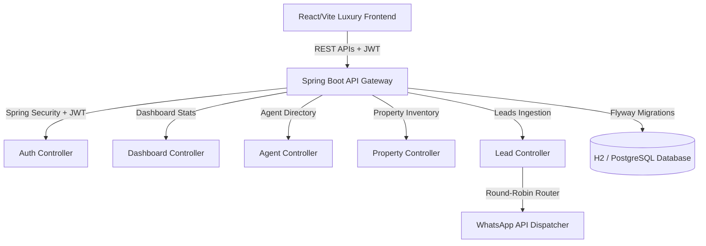

# ⚜️ 24K Realtors — Premium Real Estate Portal & CRM Dashboard

[](https://spring.io/projects/spring-boot)
[](https://react.dev)
[](https://vitejs.dev)
[](https://www.postgresql.org/)
[](https://flywaydb.org/)

**24K Realtors** is a premium, enterprise-grade real estate investment portal and CRM lead management dashboard. The system is designed for high-net-worth individuals (HNWIs) looking for luxury residential and commercial properties in Pune's high-appreciation IT corridors (*Wakad, Hinjewadi, Baner, Balewadi, Tathawade*).

The platform serves a dual purpose:
1. **The Advisory Portal:** A customer-facing investment desk featuring net yields, cap rates, Matterport 3D visual tours, capital appreciation calculators, and a grayscale "Recently Closed Deals" (FOMO) section.
2. **The CRM Lead Management Dashboard:** A secure administrative center displaying real-time statistics, lead status pipelines, and a **Relationship Manager (RM) Console** featuring conversion rates and an automated round-robin lead routing algorithm.

---

## 💎 Key Features & Modules

### 1. Front-End Investment Advisory Portal
* **Private Office HNWI Mode:** Toggle between residential standard mode and Private Office mode. When active, it displays commercial cap rates, net yields (e.g., 7.2% Net yield in Hinjewadi), and capital appreciation CAGR projections.
* **Matterport 3D Tour Integration:** Seamless interactive virtual tours embedded on listing detail modules to drive remote client engagements.
* **Closed Deals Panel:** Displays grayscale-filtered cards of recently sold/rented properties to establish market velocity (FOMO) and prompt active inquiries.
* **Appreciation & LTV Calculators:** Client-side calculators estimating 3/5/10-year capital appreciation curves and Loan-To-Value (LTV) down payment proportions.
* **MahaRERA dossier:** Slide-out drawer displaying legal verification certificates, title clearance details, and regulatory compliance disclosures.

### 2. Back-End CRM Operator Terminal
* **Real-Time Statistics Engine:** Dynamic `/stats` API returning total leads, new inquiries, active listings, and closed deals.
* **RM Performance Console:** Tracks relationship managers (Amit, Neha, Rahul) with active KPI cards, conversion progress bars, and high-performance indicator tags (🏆 *Top Performer*).
* **Round-Robin Lead Distribution:** Automated backend pipeline that dynamically routes incoming customer inquiries to available agents sequentially to ensure equal distribution and minimal response latency.
* **Security & Auth:** Spring Security integration with stateless JWT tokens to secure admin login (admin/adminpassword).

---

## 🛠️ System Architecture



---

## 🚀 Getting Started

### 📋 Prerequisites
* **Java JDK 17** or above (JDK 24 recommended).
* **Node.js 18+** & npm.
* **PostgreSQL** (Optional for production profile).

---

### 1. Backend Server Setup (Spring Boot)

The backend has two profiles configured: `dev` (default, uses in-memory H2 database with auto-seeding) and `prod` (uses PostgreSQL).

#### Running with Development Profile (H2 In-Memory)
In development mode, you do not need to install PostgreSQL. The application runs entirely on an in-memory database and seeds mock property listings and leads on boot.

Run the following in the project root:
```powershell
# Boot the Spring Boot application (using H2)
./mvnw spring-boot:run
```
The server starts on `http://localhost:8080/`. You can view the local database console at `http://localhost:8080/h2-console` (JDBC URL: `jdbc:h2:mem:twentyfourkdb`, User: `sa`, Password: `password`).

#### Running with Production Profile (PostgreSQL)
To run on PostgreSQL, configure your credentials in `src/main/resources/application.yml` or set environment variables:
```bash
$env:SPRING_PROFILES_ACTIVE="prod"
$env:DB_HOST="localhost"
$env:DB_PORT="5432"
$env:DB_NAME="twentyfourk"
$env:DB_USER="postgres"
$env:DB_PASSWORD="yourpassword"

./mvnw spring-boot:run
```

---

### 2. Frontend Portal Setup (React / Vite)

Navigate to the `frontend` folder and set up local server dependencies:
```bash
cd frontend
npm install
```

#### Running locally for Desktop testing:
```bash
npm run dev
```
The portal opens on `http://localhost:5173/`.

#### Running locally for Mobile/Tablet network testing:
To bypass browser **Mixed Content security policies** (which block HTTPS Vercel pages from calling local HTTP APIs), run the dev server with network hosting enabled:
```bash
npm run dev -- --host
```
Vite will output your local Wi-Fi address (e.g., `http://192.168.1.14:5173/`). You can open this URL directly in your mobile browser, and all local API logins and lead submissions will work flawlessly!

---

## 🛡️ Regulatory Compliance & MahaRERA
24K Realtors operates under MahaRERA Broker License Registration Number: **A52100028461**. All property inventories displayed on this portal conform to Section 11 of the Real Estate (Regulation and Development) Act. Developer listings are legally verified channel partner inventories of Tier-1 builders across Pune.
