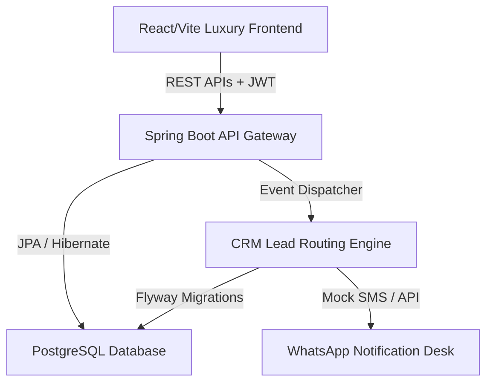

# ⚜️ 24K Realtors — Premium Location-Centric Real Estate Advisory Portal

[](https://spring.io/projects/spring-boot)
[](https://react.dev)
[](https://vitejs.dev)
[](#-regulatory-compliance--maharera)

**24K Realtors** is a world-class, HNWI-oriented real estate advisory portal specialized in Pune's high-appreciation IT corridors (*Wakad, Hinjewadi, Baner, Balewadi High Street*). Unlike traditional broker listings, this platform serves as a digital investment desk focusing on location metrics, rental yields, and structural RERA-registered title verification.

---

## 💎 Core Advisory Modules

### 1. HNWI Private Office Toggle Mode
Switching between standard homebuyer listings and institutional portfolios dynamically updates all parameters:
*   **Cap Rates & Net Yields:** Showcases rental yields on commercial and luxury residential properties (e.g. 7.2% Net yield in Hinjewadi).
*   **Asset Tax Metrics:** Shifts copy towards capital gains appreciation indexation and depreciation write-offs.

### 2. Live Tech Corridor Market Trends Index
Real-time indexing of major Pune corridors displaying:
*   **Average price/sqft** (e.g. ₹11,500/sqft in Baner link road).
*   **Year-over-Year (YoY) Capital Appreciation index** (+16% in Baner).
*   **Rental Yield ratios** (+5.2% in Hinjewadi IT parks).

### 3. VIP Chauffeur-Driven Site Visit Scheduler
Integrated luxury viewing scheduler allowing users to book site visits:
*   Includes complimentary executive pickup service across Pune.
*   Logistics are automatically logged to the CRM Lead Distribution Engine.

### 4. Interactive Financial Analysis Tools
*   **3/5/10-Year Capital Appreciation Calculator:** Forecasts future asset valuation based on historical CAGR growth rates.
*   **LTV (Loan-To-Value) visualizer:** Dynamic graphic depicting down payment equity proportions versus bank debt.
*   **Mortgage monthly EMI estimator.**

### 5. MahaRERA Regulatory Side-Drawer
Directly links RERA registered numbers to a slide-out legal dossier containing clear-title confirmations, NA status, PMRDA approvals, and legal litigation clearances.

---

## 🛠️ Technical Architecture

The platform is architected as a high-performance modern decoupled application:



### ☕ Backend Technology Stack
*   **Framework:** Spring Boot 3.x (Java 17+)
*   **Security:** Spring Security with stateless JWT Web Tokens and CORS management.
*   **Database:** PostgreSQL with Flyway database migration schema tracking.
*   **Lead CRM Engine:** Event-driven listener logging callbacks and routing leads dynamically to local corridor managers.
*   **Services:** Mock WhatsApp communication dispatcher.

### ⚛️ Frontend Technology Stack
*   **Framework:** React 18, Vite Bundler.
*   **Styling:** HSL dynamic color variables, Glassmorphism, and metallic gold linear-gradient borders.
*   **Icons:** Lucide-React.

---

## 🚀 Getting Started

### 📋 Prerequisites
*   **Java JDK 17** or above installed.
*   **Node.js 18+** & npm.
*   **PostgreSQL** instance running.

### 1. Database Configuration
Update `src/main/resources/application.yml` with your PostgreSQL credentials:
```yaml
spring:
  datasource:
    url: jdbc:postgresql://localhost:5432/twentyfourk_db
    username: your_username
    password: your_password
```

### 2. Run Backend Service
Build and boot the Spring Boot server using Maven:
```bash
# Set Java Home if required and run Spring Boot
./mvnw spring-boot:run
```
The REST API will boot on `http://localhost:8080/`.

### 3. Run Frontend Portal
Initialize React modules and boot the Vite development server:
```bash
# Navigate to frontend and run
cd frontend
npm install
npm run dev
```
The advisory portal will open on `http://localhost:5173/`.

---

## 🛡️ Regulatory Compliance & MahaRERA
24K Realtors operates under MahaRERA Broker License Registration Number: **A52100028461**. All listings displayed on the platform conform strictly to RERA section 11 requirements. Developer partnerships are legally authorized via channel partner certificates with Tier-1 builders (VTP, Kolte-Patil, Godrej Properties, Panchshil).
